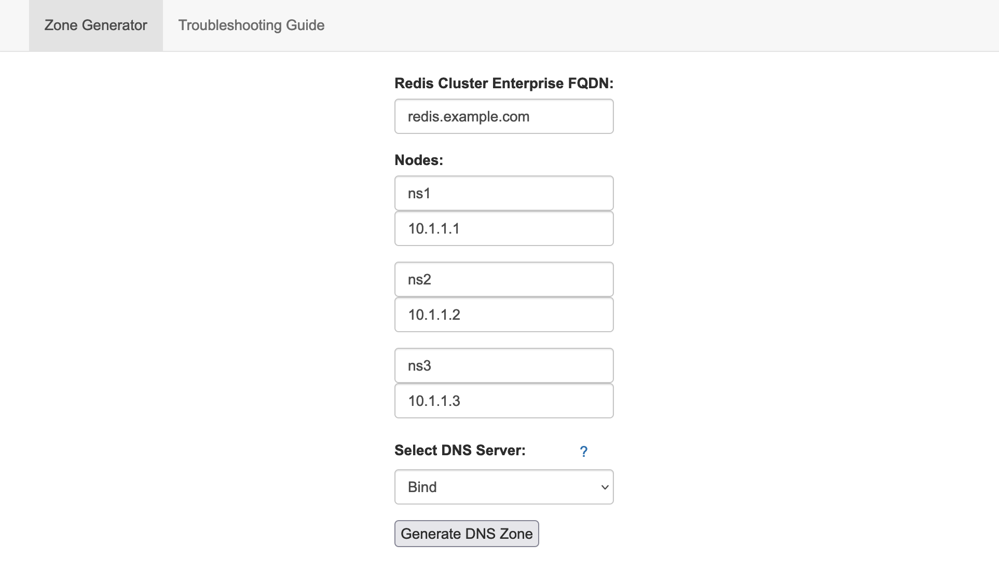
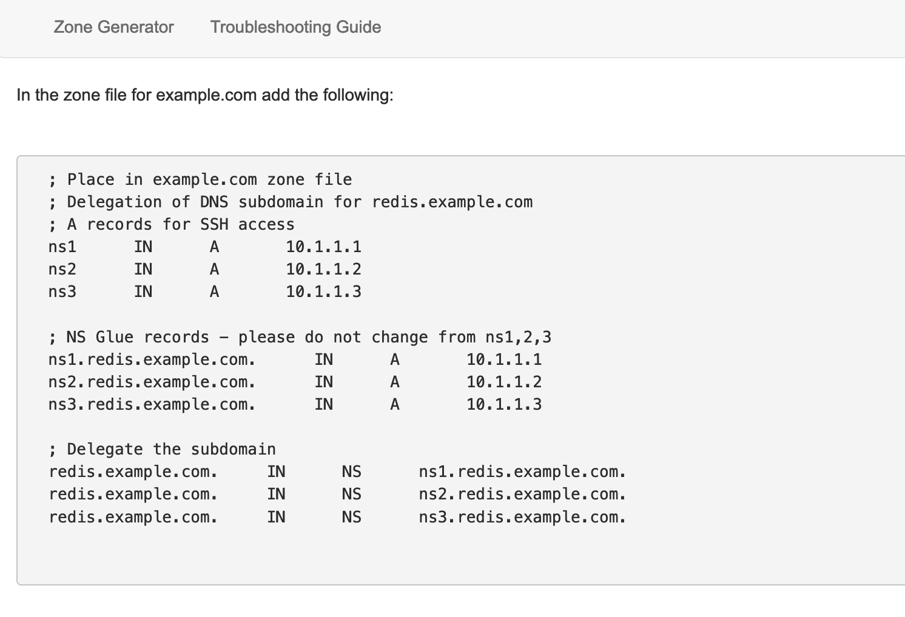

# DNS Zone Generator

DNS Zone Generator is a web-based tool that generates DNS settings for Redis Enterprise clusters.

### Zone generation

This tool generates configurations for the following DNS servers/services:
- Bind
- Azure (graphical)
- Azure Terraform
- AWS Route53 Terraform
- AWS Route53 (graphical)
- Google Cloud CLI
- Google Cloud (graphical)
- Google Cloud Terraform

### Troubleshooting

Provides step-by-step troubleshooting of DNS Zone delegation to ensure ease of use.

## Running locally

First, build the Docker image:

```
docker build -t dns-zone-generator .
```

Next, run the container:

```
docker run -p8080:8080 -t -i dns-zone-generator
```

Finally, use your web browser to naviate to [http://localhost:8080](http://localhost:8080).

## Using

First, configure your FQDN, DNS zones, and platform:



<hr/>

The tool will then generate your zone configuration:



## Development

DNS Zone Generator is a [Flask](https://flask.palletsprojects.com/en/2.2.x/) app. To run the application in development mode, you'll need Python 3.6. We also recommend [pyenv](https://github.com/pyenv/pyenv#getting-pyenv) for managing your Python evironment.

From the **root directory** of the application, do the following:

1. Install Python 3.6:

```
pyenv install 3.6
```

2. Create a virtual environment for the application's dependencies, and select this environment:

```
pyenv virtualenv 3.6 dns-zone-generator
pyenv local dns-zone-generator
```

3. Install the dependencies:

```
pip install -r requirements.txt
```

4. Run the Flask app:

```
flask run -p 8080
```

If the app starts correctly, you can access the tool at [http://localhost:8080](http://localhost:8080).

## License

DNS Zone Generator is licensed under the MIT License. See LICENSE for details.
